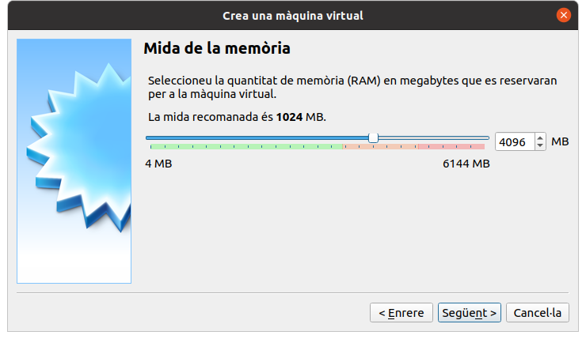

# mycroft des de zero
# Creació d'una màquina virtual

Mycroft funciona a Linux, així que si feu servir un altre sistema operatiu, o no voleu instal·lar Mycroft (i les dependències necessàries) en el vostre equip habitual, l'opció més senzilla és muntar una màquina virtual amb Virtualbox.

- Baixeu una ISO d'un Linux basat en Debian. En aquesta guia usarem [Ubuntu 20.04 LTS per a escriptori](https://ubuntu.com/download/desktop), però la versió de servidor és millor si no necessitem interfície gràfica, perquè requereix menys recursos.
- Baixeu i instal·leu [Virtualbox](htps://www.virtualbox.org/) per al vostre sistema operatiu. Hauria de ser la versió 6.010 o superior.
- Obriu el VirtualBox application i feu clic a «Nova»
- Poseu un nom a la màquina (Mycroft-Ubuntu) i trieu Linux i Ubuntu (64-bit). P. ex. «Mycroft-Ubunt»
- 
- Continueu per la resta de la de la configuració de la màquina virtual amb les opcions predeterminades. Més RAM no fa mai mal, però amb 4 GB si useu Ubuntu d'escriptori o 1 GB si Ubuntu per a servidor, n'hauríeu de tenir prou. Amb un disc dur de 30 Gb n'hauria de tenir prou.



- Seleccioneu la màquina virtual que heu creat i inicieu-la!
- Us demanarà de triar un disc òptic virtal. Feu clic a la icona de la carpet i afegiu-hi el disc ISO d'Ubuntu que hem baixat al principi de tot.


Engegarà Ubuntu i podreu fer una instal·lació predeterminada.


En aquesta guia, usarem l'usuari «mycroft», amb contrasenya «mycroft», però podeu usar qualsevol usuari i contrasenya, evidentment.


- Reinicieu la màquina virtual al final del procès. Si heu instal·lat Ubuntu per a servidors cal que pitgeu la tecla retorn un parell de vegades.

- Inicieu sessió amb les credencials que heu definit durant la instal·lació (mycroft, mycroft).


- Ja teniu una màquina virtual Ubuntu! Ara cal instal·lar-hi Mycroft.

# Instal·lació de Mycroft
Per a instal·lar Mycroft, només cal executar aquestes ordres en una finestra de terminal de la màquina virtual anterior:

```
sudo apt-get update
sudo apt-get install -y alsa pulseaudio git
git clone https://github.com/MycroftAI/mycroft-core.git
cd mycroft-core
./dev_setup.sh -fm
```
Això baixa el codi del nucli de Mycroft i executa l'instal·lador de dependències.

- A la pregunta ```Do you want to run on 'master' or against a dev branch?```, respongueu N. Així usareu la branca de desenvolupament del nucli de Mycroft.
- A la pregunta ```Would you like to automatically update whenever launching Mycroft?``` respongueu Y. Aixi Mycroft s'actualitzarà automàticament.
- A la pregunta ```Would you like this to be added to your PATH in the .profile?````, respongueu Y. Així podreu executar algunes ordres de Mycroft direcgtament.
- L'instal·lador us demanarà la contrasenya per a crear la carpeta que contindrà les habilitats ```/opt/mycroft/skills```
- A la pregunta ```Do you want to automatically check code-style when submitting code.````, respongueu Y.
- Es possible que us demani confirmació per a instal·lar els paquests necessaris ```Do you want to continue?```, respongueu Y.
- Ara trigarà una mica en instal·lar Mycroft. Una vegada hagi acabat, és millor reniciar la màquina virtual on heu instal·lat Mycroft.
- Una vegada heu reniciat, obriu una finestra de terminal, aneu a ~/mycroft-core i activeu l'entern de desenvolupament: ```source venv-activate.sh```
- Podeu iniciar Mycroft amb ```./start-mycroft.sh debug```
- Si tot ha funcionat bé, us demanarà de registrar el vostre aparell a http://home.mycroft.ai. Feu-ho. Obriu una finestra del navegador web i aneu a https://home.mycroft.ai, només cal crear-vos un compte i registrar l'aparell amb el codi de 6 dígits que us diu.
- Per a sortir de Mycrot poder fer ```:quit``` i, una vegada en el terminal executeu ```./stop-mycroft.sh``` per a aturar els serveis de Mycroft.
- Ja teniu un Mycroft funcional, en anglès. Ara manca configurar-lo en català.


# Configuració de Mycroft en català
Teniu una guia molt completa per a configurar Mycroft en català [aquí](https://github.com/JarbasLingua/mycroft-catalan.conf/blob/main/readme-ca.md), que us recomanem llegir, però el resum és:


## Apedaceu lingua franca
Cal apedaçar la biblioteca ```lingua franca``` mentre el català no arrriba a la branca estable. Per a fer-ho, baixem i instal·lem la versió de lingua franca del repositori de Softcatalà:

```
cd ~
git clone https://github.com/softcatala/lingua-franca
cd mycroft-core
pip install ../lingua-franca/
```
## Apliqueu les traduccions de les habilitats
Ara per ara, cal aplicar les traduccions de les habilitats que es fan al portal de traduccions https://translate.mycroft.ai.

```
cd ~
git clone https://github.com/jmontane/mycroft-update-translations
cd mycroft-update-translations
pip install -r requirements.txt
./mycroft-update-translations.py
```

## Instal·leu el mòdul STT

```
cd ~/mycroft-core
mycroft-pip install jarbas-stt-plugin-chromium
```
## Instal·leu festival

```
sudo apt-get -y install festival festvox-ca-ona-hts lame
```

## Instal·leu l'extensió snowboy

Si poseu Mycroft a dormir amb l'habilitat ```snpatime```, ens caldrà personalitzar la paraula d'activació "wake up", per a pofer-ho fer, instal·lem l'extensió ```snowboy```

```
mycroft-pip install jarbas-wake-word-plugin-snowboy
```

## Instal·leu l'habilitat alternativa a Wolfram Alpha


Si Mycroft no "captura" l'ordre que li envia l'usuari, l'envia a l'habilitat Wolfram Alpha, però aquesta habilitat té força errors i no funciona correctament en català. Així que és millor usar auqesta habilitat alternativa:

```msm install https://github.com/JarbasSkills/skill-wolfie```

## Instal·leu l'habilittat de notícies alternativa
L'habilitat de notícies té un problema amb els fluxos d'àudio http. Mentre es corregeix, millor usar aquesta habilitat alternativa.

```msm install https://github.com/JarbasLingua/skill-news``` 


## Editeu el fitxer ```~/.mycroft/mycroft.conf```
Amb aquesta configuració al fitxer mycroft.conf, Mycroft us hauria de funciona en català:

```
{
  "lang": "ca-es",
  "stt": {
      "module": "chromium_stt_plug",
      "chromium_stt_plug": {
          "lang": "ca-ES"
      }
   },
  "tts": {
      "module": "festival",
      "festival": {
          "lang": "catalan",
          "encoding": "ISO-8859-15//TRANSLIT"
      }
   },
  "skills": {
    "blacklisted_skills": [
          "mycroft-npr-news.mycroftai", 
          "mycroft-fallback-duck-duck-go.mycroftai", 
          "mycroft-joke.mycroftai"
    ]
  },
  "listener": {
      "stand_up_word": "desperta"
  },
  "hotwords": {
     "desperta": {
        "module": "snowboy_ww_plug",
        "models": [
            {"sensitivity": 0.5, "model_path": "desperta_jm.pmdl"},
           {"sensitivity": 0.5, "model_path": "desperta_jm2.pmdl"}
         ]
      }
   }
}
```

Finalment, ja podeu executar Mycroft en català!

```
./start-mycroft.sh debug
``` 

Espereu uns segons que es carregi i digueu:

```
ei, Mycroft, quina hora és
```
Si tot ha anat correctament, Mycroft us dira l'hora del sistema, en català.

# Comunitat de Mycroft en català
Si teniu int

- [Grup Mycroft en català de Telegram](https://t.me/Mycroftencatala) per a traductors
- [Xat language-ca](https://chat.mycroft.ai/community/channels/language-ca) a Mycroft per a desenvolupadors
